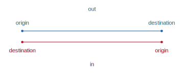
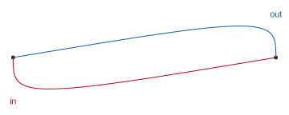

```{r, include=FALSE}
knitr::opts_chunk$set(
  collapse = TRUE,
  comment = "#>",
  fig.path = "man/figures/README-",
  out.width = "100%"
)
```

# odvis

[](https://github.com/rogerbeecham/odvis/actions/workflows/R-CMD-check.yaml)


`odvis` is an R package that provides helper functions for visualizing directed origin-destination data using `ggplot2`.  

## Installation

You can install the development version of `odvis` from [GitHub](https://github.com/) with:

``` {r, install_github, eval=FALSE}
# install.packages("devtools")
devtools::install_github("rogerbeecham/odvis")
```

``` {r, load_packages, include = FALSE}
# For reproducing this document.
library(tibble)
library(dplyr)
library(ggplot2)
library(ggforce)
library(purrr)
library(tidyr)
library(sf)
library(patchwork)
library(odvis)
```

```{r hidden_options, include=FALSE}
#misc options
options(width = 90)
theme_set(theme_void())
```

## Asymmetric curves with `get_trajectory()`

Standard flow visualizations draw lines between origin-destination pairs. In `ggplot2` this can be achieved by passing coordinates to `geom_path()`, one row for *origin* and *destination* respectively. In order to represent both outward and inward directions, we have to offset the locations (y-position) of the coordinate pairs.


``` {r, straight-line, eval=FALSE}
od_pair <- tribble(
      ~direction, ~o_d,    ~x, ~y, 
       "out",        "origin",   0,  .2,   
       "out",        "destination",   1,  .2,
       "in",         "origin",   1,  -.2,
       "in",         "destination",   0,  -.2,
)      
     
od_pair |> 
  ggplot() +
  geom_point(aes(x=x, y=y*.2, group=direction, colour=direction)) +
  geom_path(aes(x=x, y=y*.2, group=direction, colour=direction)) +
  geom_text(aes(x=x, y=y*.5, label=o_d, colour=direction)) +
  geom_text(data=. %>% filter(o_d=="origin"), aes(x=.5, y=y, label=direction, colour=direction)) +
  scale_colour_manual(values=c("#b2182b", "#2166ac"), guide="none") +
  coord_equal(ylim=c(-.2, +.2), xlim=c(-.1, +1.1)) 

```



The [`ggforce`](https://ggforce.data-imaginist.com/) extension provides a function for generating various curves, and we can use `geom_bezier()` to add a control point to offset curves depending on whether the direction is *outward* (bends upward) or *inward* (bends downward). This allows us to represent the origin and destination point locations in their exact position.

``` {r, bezier-line, eval=FALSE}
od_pair <- tribble(
      ~direction, ~o_d,    ~x, ~y, 
       "out",        "o",   0,  .015,   
       "out",        "c",   0.5,  .2, 
       "out",        "d",   1,.015,
       "in",         "o",   1,  -.015,
       "in",        "c",   0.5,  -.2, 
       "in",         "d",   0,  -.015,
)      
     
od_pair |> 
  ggplot() +
  geom_point(data=. %>% filter(o_d!="c"), aes(x=x, y=0, group=direction)) +
  geom_bezier0(aes(x=x, y=y, group=direction, colour=direction)) +
  geom_text(data=. %>% filter(o_d!="c"), 
            aes(x=x, y=y*3, label=o_d, colour=direction)) +
  geom_text(data=. %>% filter(o_d=="o"), aes(x=.5, y=y*12, label=direction, colour=direction)) +
  scale_colour_manual(values=c("#b2182b", "#2166ac"), guide="none") +
  coord_equal(ylim=c(-.2, +.2), xlim=c(-.1, +1.1))
```


A problem here is that the control point is not generalisable and the symbolisation not intuitive. The outward and inward directions are differentiated, but imagine a complex graph dataset with many edges in 2D space. So we move the control points such that lines curve towards the destination. This is achieved with `get_trajectory()`, which takes  a character string naming the od-pair and locations in x and y of that OD's origin an destination. The function returns a `tibble` of three rows representing origin, control point and destination respectively.  

``` {r, bezier-line-asymmetric, eval=FALSE}
dat <- bind_rows(
  outward=get_trajectory(o_x=0,o_y=0,d_x=1,d_y=0, "out") |>
  add_column(type=c("o","c","d")), 
  inward=get_trajectory(o_x=1,o_y=0,d_x=0,d_y=0, "in") |> 
  add_column(type=c("o","c","d"))
  )

dat |> 
  ggplot(aes(x=x,y=y, colour=od_pair)) +
  geom_point(data=. %>% filter(type!="c"), colour="#252525") +
  ggforce::geom_bezier0(aes(group=od_pair)) +
   geom_text(data=. %>% filter(type=="c"), aes(label=od_pair)) +
  scale_colour_manual(values=c("#b2182b", "#2166ac"), guide="none") +
  coord_equal() 
```



### Example

``` {r, apply-bezier-line, eval=FALSE, echo=FALSE}
# Get trajectories for heavily cycled OD pairs.
trajectories <- bs_ods |> 
  filter(o_station!=d_station) |> 
  group_by(od_pair, o_station, d_station) |> 
  summarise(count=sum(count)) |> ungroup() |> unique() |> 
  filter(count>100) |> 
  left_join(
    bs_stations |> 
      transmute(
        o_station=as.character(id), 
        o_point=str_extract(str_remove(geometry,"^POINT \\("), "(?<=\\().*(?=\\))")) |>
      separate(col=o_point, sep=", ", into=c("o_east", "o_north")) |> 
      st_drop_geometry()) |> 
  left_join(
    bs_stations |> transmute(
        d_station=as.character(id), 
        d_point=str_extract(str_remove(geometry,"^POINT \\("), "(?<=\\().*(?=\\))")) |>
      separate(col=d_point, sep=", ", into=c("d_east", "d_north")) |> 
      st_drop_geometry()) |>
  mutate(across(o_east:d_north, ~as.numeric(.x))) |> 
  nest(
    data=c(od_pair, o_east, o_north, d_east, d_north)
    ) |> 
  mutate(
    trajectory=map(data, ~get_trajectory(
      .x$o_east, .x$o_north, .x$d_east, .x$d_north, .x$od_pair)
      )) |> 
  select(trajectory) |> unnest(cols=trajectory)

# Data for drawing legend.
dat <- get_trajectory(0,1,1,1,"demo") |>  
  mutate(
    row=row_number(),
    type=if_else(row==1,"origin", if_else(row==2,"mid", "destination"))
    )
# Plot legend
legend <- ggplot() +
  geom_point(data=dat %>% filter(row!=2), aes(x=x, y=y), size=1, colour="#737373", alpha=0.5)+
  ggforce::geom_bezier0(data=dat, aes(x=x, y=y, group=od_pair), colour="#737373", alpha=.8)+
  coord_equal()+
  geom_text(data=dat %>% filter(row!=2),
            aes(x=x, y=y-0.1, label=type), 
            colour="#252525", size=2.5, show.legend=FALSE, hjust="Middle", vjust="Top")+
  scale_x_continuous(limits=c(-0.1,1.3))+
  scale_y_continuous(limits=c(0.8,1.19))

# Plot extents in geographic space.
bbox <- st_bbox(bs_villages)
width <- unname(bbox$xmax)-unname(bbox$xmin) 
height <- unname(bbox$ymax)-unname(bbox$ymin) 
aspect <- width/height

# Villages in London to label for context.
village_labels <- c("Bank", "Westminster", "King's Cross", "Hyde Park", "Holborn", "Putney | Wandsworth", "Liverpool Street", "Vauxhall | Kennington", "Strand | Covent Garden")

# Plot data : counts by evening peak.
dat <- trajectories |>   ungroup() |> 
  left_join(bs_ods |> filter(period=="am") |>  select(od_pair, count)) |> 
  filter(count>100) |> 
  mutate(f_od=(count/max(count))^.7)
# Order drawming so most prominant ODs are drawn last.
order_ods <- dat |> arrange(f_od) |> pull(od_pair) |> unique()

am <- dat |>
  # Recode od_pair as factor for ordering.
  mutate(od_pair=factor(od_pair, levels=order_ods)) |> 
  ggplot() +
  geom_sf(data=bs_villages, fill="#f0f0f0",  colour="#bdbdbd", linewidth=.05, alpha=.5)+
  geom_sf(data=rivers, fill="#d9d9d9",  colour="#d9d9d9")+
  ggforce::geom_bezier0(
     aes(x=x, y=y, group=od_pair, alpha=f_od, colour=f_od, linewidth=f_od)
     ) +
  geom_text(data=bs_villages %>% filter(name %in% village_labels), aes(x=easting, y=northing, label=name), size=2.5, alpha=.5 ) +
  annotate("text", x=bbox$xmax, y=bbox$ymin, label="weekday morning peak", hjust=1, size=3.5) +
  coord_sf(crs=st_crs(bs_villages), datum=NA)+
  scale_colour_distiller(palette="Blues", direction=1, guide="none")+
  scale_linewidth_continuous(range=c(.3,1), guide="none") +
  scale_alpha(range=c(.3,1), guide="none") +
  annotation_custom(
    grob=ggplotGrob(legend),
    xmin=unname(bbox$xmin-+0.05*width),
    xmax=unname(bbox$xmin+0.2*width),
    ymin=unname(bbox$ymax)-0.1*height,
    ymax=unname(bbox$ymax)
  )

dat <- trajectories |>   ungroup() |> 
  left_join(bs_ods |> filter(period=="pm") |>  select(od_pair, count)) |> 
  filter(count>100) |> 
  mutate(f_od=(count/max(count))^.7)
order_ods <- dat |> arrange(f_od) |> pull(od_pair) |> unique()

pm <- dat |> 
  mutate(od_pair=factor(od_pair, levels=order_ods)) |> 
  ggplot() +
  geom_sf(data=bs_villages, fill="#f0f0f0",  colour="#bdbdbd", linewidth=.05, alpha=.5)+
  geom_sf(data=rivers, fill="#d9d9d9",  colour="#d9d9d9")+
  ggforce::geom_bezier0(
     aes(x=x, y=y, group=od_pair, alpha=f_od, colour=f_od, linewidth=f_od)
     ) +
  geom_text(data=bs_villages %>% filter(name %in% village_labels), aes(x=easting, y=northing, label=name), size=2.5, alpha=.5 ) +
  annotate("text", x=bbox$xmax, y=bbox$ymin, label="weekday evening peak", hjust=1, size=3.5) +
  coord_sf(crs=st_crs(bs_villages), datum=NA)+
  scale_colour_distiller(palette="Blues", direction=1, guide="none")+
  scale_linewidth_continuous(range=c(.3,1), guide="none") +
  scale_alpha(range=c(.3,1), guide="none") +
  annotation_custom(
    grob=ggplotGrob(legend),
    xmin=unname(bbox$xmin-+0.05*width),
    xmax=unname(bbox$xmin+0.2*width),
    ymin=unname(bbox$ymax)-0.1*height,
    ymax=unname(bbox$ymax)
  )

plot <- am / pm 

ggsave(filename=here("man","figures","bezier-application.svg"), plot=plot,width=9, height=9)
```


## OD Maps


