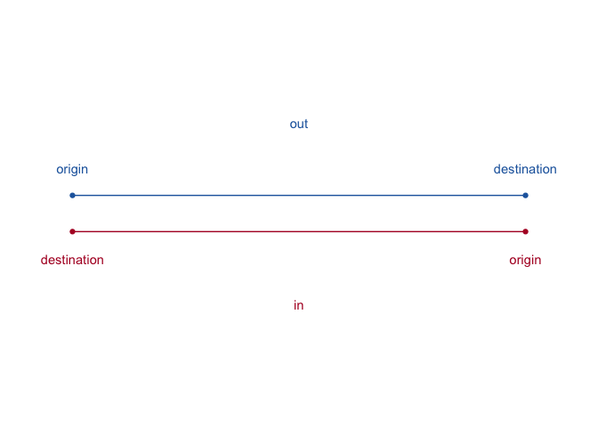
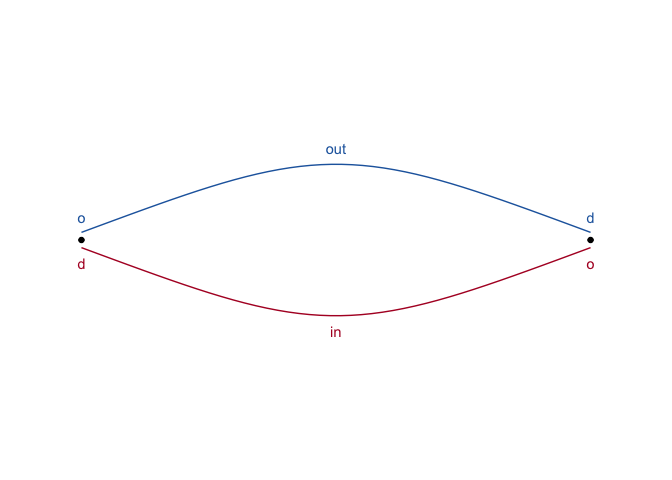
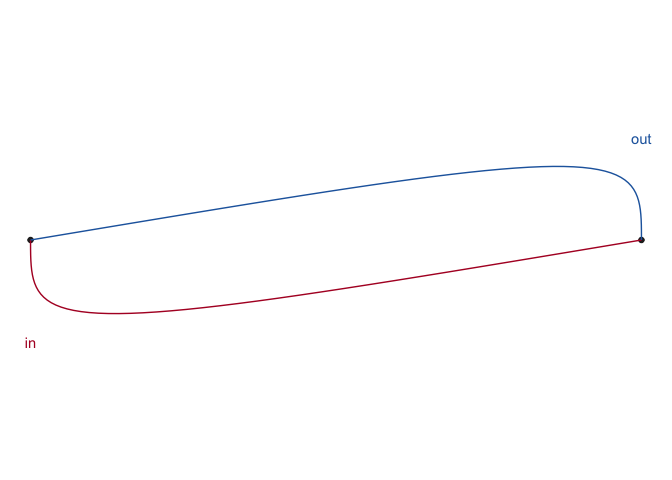

# odvis

[](https://github.com/rogerbeecham/odvis/actions/workflows/R-CMD-check.yaml)

`odvis` is an R package that provides helper functions for visualizing
directed origin-destination data using `ggplot2`.

## Installation

You can install the development version of `odvis` from
[GitHub](https://github.com/) with:

``` r
# install.packages("devtools")
devtools::install_github("rogerbeecham/odvis")
#> 
#> ── R CMD build ─────────────────────────────────────────────────────────────────
#>      checking for file ‘/private/var/folders/5x/wcs8tp_95md1j7l5cprqt7mm0000gq/T/RtmpvfIIGh/remotes11f86179a9c23/rogerbeecham-odvis-6deb0aa/DESCRIPTION’ ...  ✔  checking for file ‘/private/var/folders/5x/wcs8tp_95md1j7l5cprqt7mm0000gq/T/RtmpvfIIGh/remotes11f86179a9c23/rogerbeecham-odvis-6deb0aa/DESCRIPTION’
#>   ─  preparing ‘odvis’:
#>      checking DESCRIPTION meta-information ...  ✔  checking DESCRIPTION meta-information
#>   ─  checking for LF line-endings in source and make files and shell scripts
#>   ─  checking for empty or unneeded directories
#>   ─  building ‘odvis_0.0.0.9000.tar.gz’
#>      
#> 
library(tibble)
library(dplyr)
library(ggplot2)
library(ggforce)
library(odvis)
```

## Asymmetric curves with `get_trajectory()`

Standard flow visualizations draw lines between origin-destination
pairs. In `ggplot2` this can be achieved by passing coordinates to
`geom_path()`, one row origin and destination respectively. In order to
represent both outward and inward directions, we have had to offset the
locations (y-position) of the coordinate pairs.

``` r
od_pair <- tribble(
      ~direction, ~o_d,    ~x, ~y, 
       "out",        "origin",   0,  .2,   
       "out",        "destination",   1,  .2,
       "in",         "origin",   1,  -.2,
       "in",         "destination",   0,  -.2,
) 

od_pair |> 
  ggplot(aes(x=x, y=y, group=direction, colour=direction)) +
  geom_point() +
  geom_path()
```



The [`ggforce`](https://ggforce.data-imaginist.com/) extension provides
a function for generating various curves, and we can use geom_bezier()
to add a control point to offset curves depending on whether the
direction is outward (bends upward) or inward (bends downward). This
allows us to represent the origin and destination point locations in
their exact position.



A problem here is that the control point is not generalisable and the
symbolisation not intuitive. The outward and inward directions are
differentiated, but imagine a complex graph dataset with many edges
connecting nodes in 2D space. So we move the control points such that
lines curve towards the destination. This is achieved with
`get_trajectory()`, which takes a character string naming the od-pair
and locations in x and y of that OD’s origin an destination. The
function returns a `tibble` of three rows representing, origin control
point and destination respectively.

``` r
outward <- get_trajectory(o_x=0,o_y=0,d_x=1,d_y=0, "out") |>
  add_column(type=c("o","c","d"))
inward <- get_trajectory(o_x=1,o_y=0,d_x=0,d_y=0, "in") |> 
  add_column(type=c("o","c","d"))
dat <- bind_rows(outward, inward)

dat |> 
  ggplot(aes(x=x,y=y, colour=od_pair)) +
  geom_point(data=. %>% filter(type!="c"), colour="#252525") +
  ggforce::geom_bezier0(aes(group=od_pair)) +
   geom_text(data=. %>% filter(type=="c"), aes(label=od_pair)) +
  scale_colour_manual(values=c("#b2182b", "#2166ac"), guide="none") +
  coord_equal() +
  theme_void()
```



## Application
